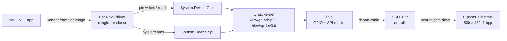
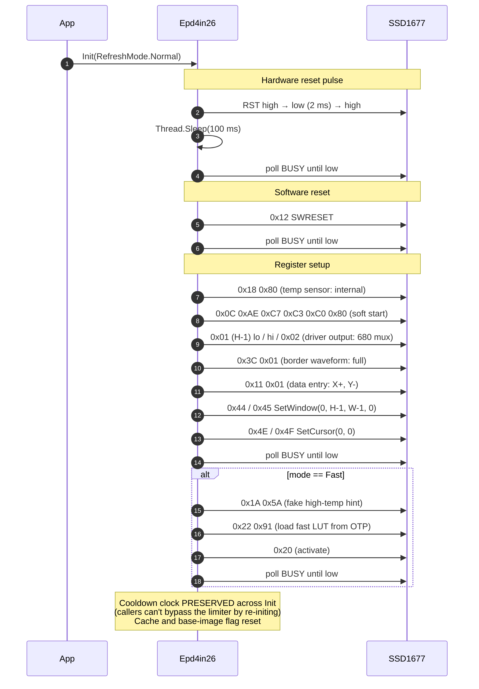
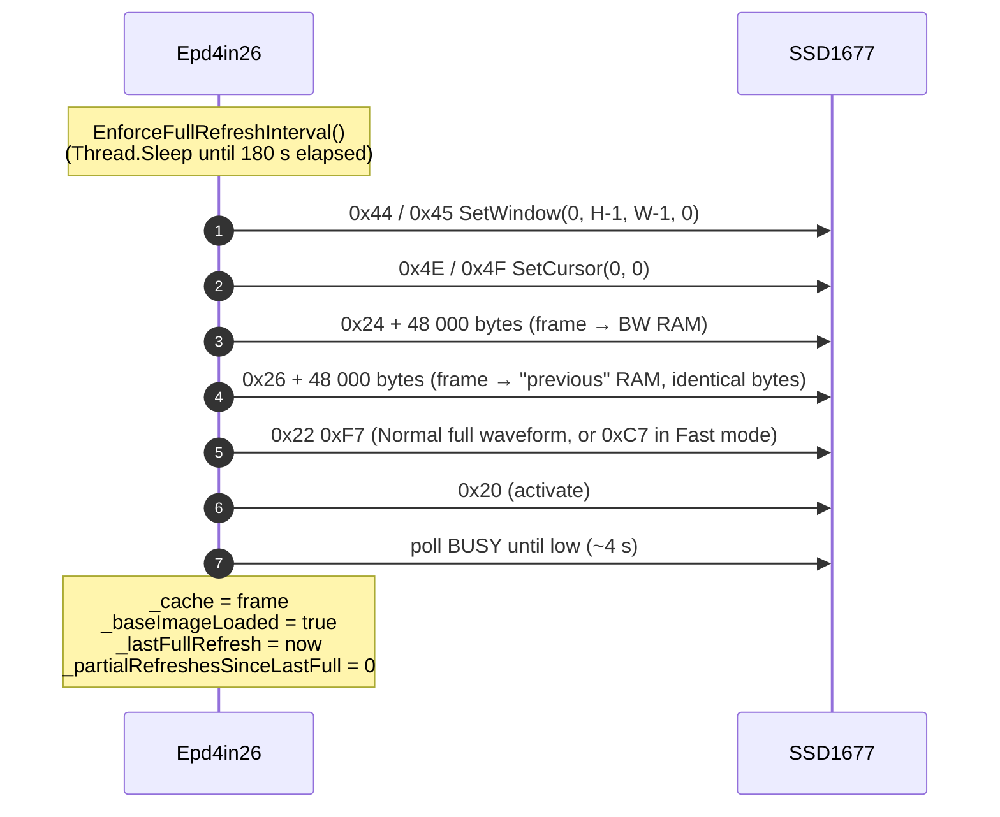
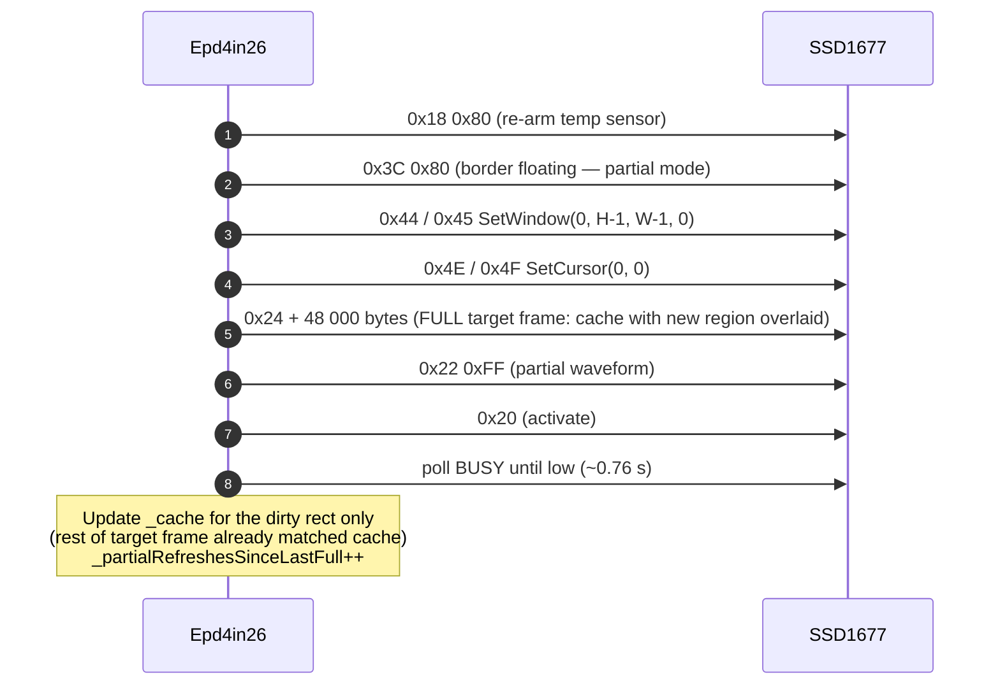
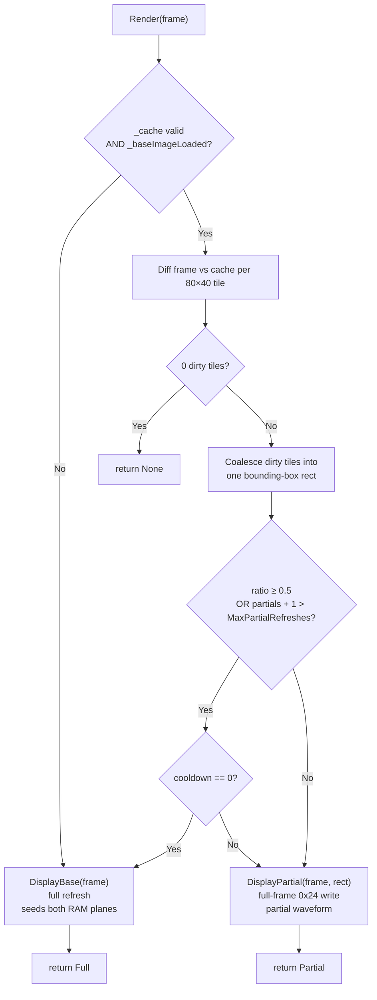
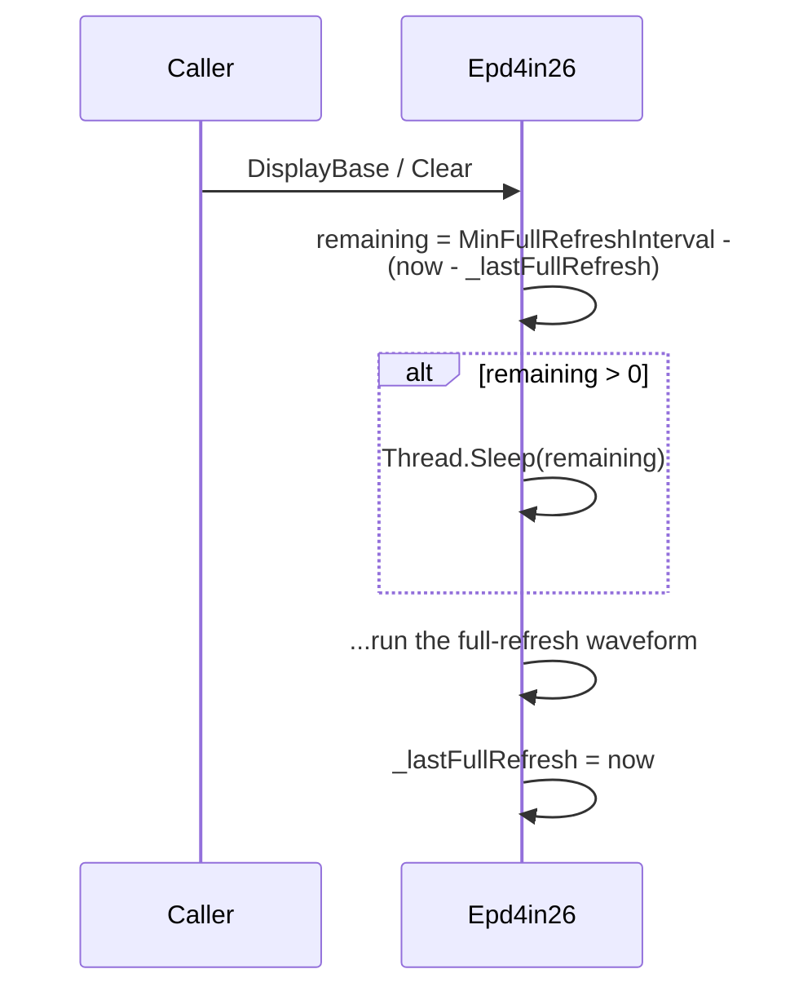
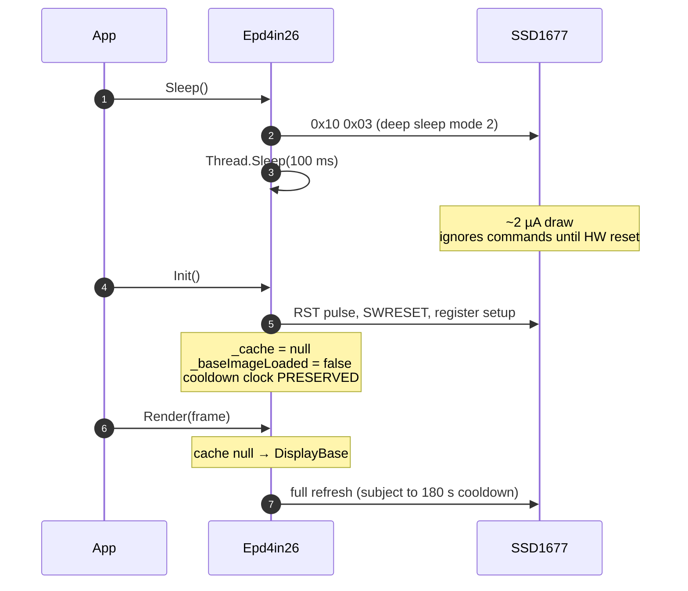

# Protocol reference

How the [`Epd4in26`](src/Epd4in26/Epd4in26.cs) driver talks to the Waveshare 4.26"
e-Paper HAT, what the SSD1677 controller actually does on the wire, and the rules and
gotchas that come from running 1 bpp e-paper electrophoretic ink in software.

If you only want to render PNGs and move on, the [README](README.md) is the right
document. This one is for people debugging the wire, porting the driver to a related
panel, auditing the panel-protection logic, or reading the SSD1677 datasheet alongside
the code.

## Contents

- [System architecture](#system-architecture)
- [Frame format](#frame-format)
- [Hardware interface](#hardware-interface)
- [Initialization sequence](#initialization-sequence)
- [Full refresh protocol](#full-refresh-protocol)
- [Partial refresh protocol](#partial-refresh-protocol)
- [The RAM 0x24 vs 0x26 model](#the-ram-0x24-vs-0x26-model)
- [Render decision flow](#render-decision-flow)
- [Tile-based dirty detection](#tile-based-dirty-detection)
- [Refresh-cadence safety](#refresh-cadence-safety)
- [Sleep and wake](#sleep-and-wake)
- [SSD1677 command cheat-sheet](#ssd1677-command-cheat-sheet)
- [References](#references)

## System architecture



The driver is a single `.cs` file. It does no buffering, threading, or queuing of its
own beyond a re-entrancy guard on `TryRender`/`TryClear`. Every `Render` call is a
synchronous round-trip from your code to the panel and back, including a busy-wait on
the chip's `BUSY` pin.

## Frame format

A frame is a flat `byte[]` of exactly **48 000 bytes** (`Width × Height / 8` =
`800 × 480 / 8`). The driver exposes this as `Epd4in26.FrameSize`.

| Property | Value |
|----------|-------|
| Resolution | 800 × 480 |
| Depth | 1 bpp |
| Packing | MSB-first within each byte |
| Bit polarity | bit `1` = white, bit `0` = black |
| Row order | top-to-bottom (image coordinates: Y=0 is the top row) |
| Column order | left-to-right within each row |

The chip's RAM-Y addressing is inverted (RAM-Y=0 is the bottom row of the panel), but
the driver mirrors that internally — callers always work in image coordinates.

### Byte layout

```
Frame[0]      = pixels at (x=0..7,  y=0)        ← MSB is pixel (0, 0)
Frame[1]      = pixels at (x=8..15, y=0)
...
Frame[99]     = pixels at (x=792..799, y=0)
Frame[100]    = pixels at (x=0..7,  y=1)
...
Frame[47999]  = pixels at (x=792..799, y=479)

Within a byte:  bit7 bit6 bit5 bit4 bit3 bit2 bit1 bit0
                 ↑                                    ↑
            leftmost pixel                  rightmost pixel
            (lower x)                        (higher x)
```

X and width must always be **multiples of 8** at the byte boundary. The SSD1677
ignores the low 3 bits of the X cursor, so a partial-refresh region whose X start
isn't byte-aligned would silently snap to the previous byte boundary on the panel.

### Producing a frame

`Epd4in26.PackFromImage(Image<Rgba32>, byte threshold = 128)` does the conversion
from any ImageSharp-readable colour image:

1. For each pixel, compute BT.601 luma: `Y = (R·299 + G·587 + B·114) / 1000`.
2. Compare against `threshold` (default 128).
3. `Y ≥ threshold` → bit set (white); `Y < threshold` → bit cleared (black).

Disable anti-aliasing when drawing into the source image
(`GraphicsOptions.Antialias = false`) — AA grays threshold poorly to a 1-bit panel
and leave visible jaggies. The test pattern generator does this throughout
([PatternGenerator.cs](tests/Epd4in26.Hardware/PatternGenerator.cs)).

## Hardware interface

The Pi talks to the HAT over five GPIO lines + 3.3 V/GND. Logic is 3.3 V on both
sides; do not drive 5 V into these pins.

### Pinout

| HAT pin | Pi pin (BCM) | Direction | Function |
|---------|--------------|-----------|----------|
| `VCC`   | 3.3 V        | -         | Logic supply |
| `GND`   | GND          | -         | Ground |
| `DIN`   | GPIO 10 (MOSI) | Pi → HAT | SPI data |
| `CLK`   | GPIO 11 (SCLK) | Pi → HAT | SPI clock |
| `CS`    | GPIO 8       | Pi → HAT  | Chip select, active low |
| `DC`    | GPIO 25      | Pi → HAT  | Data (HIGH) / Command (LOW) discriminator |
| `RST`   | GPIO 17      | Pi → HAT  | Hardware reset, active low |
| `BUSY`  | GPIO 24      | HAT → Pi  | Controller busy (see polarity note below) |
| `PWR`   | GPIO 18      | Pi → HAT  | Panel VCC gate on newer HATs — must be HIGH |

All pins are overridable in the `Epd4in26` constructor.

### SPI parameters

| Parameter | Value | Notes |
|-----------|-------|-------|
| Mode      | Mode 0 (CPOL=0, CPHA=0) | datasheet §12.1 |
| Bit order | MSB first | |
| Max clock | 20 MHz write, 2.5 MHz read | datasheet §7.4. Driver reads zero bytes — only writes — so the 20 MHz limit applies |
| Default clock | 20 MHz | Lower via constructor (`spiClockHz`) if the cable to the panel is long |

### Command vs data

Each SPI transaction is gated by `CS` (active low) and discriminated by `DC`:

| step | DC | CS | bytes on MOSI | what happens |
|------|----|----|---------------|--------------|
| 1 | low | high → low | (one byte) | chip latches the command byte while DC is low |
| 2 | low | low → high | - | end of command transfer |
| 3 | high | high → low | (zero or more bytes) | chip latches the data payload while DC is high |
| 4 | high | low → high | - | end of data transfer |

This driver issues a separate `CS` pulse for the command and a separate pulse for the
payload. Some implementations stream both inside one `CS` pulse and just toggle `DC`
mid-stream — the chip accepts either pattern.

### BUSY pin polarity

The SSD1677 drives `BUSY` **high while busy, low when ready** — opposite polarity to
the older UC8xxx controllers. `WaitUntilReady` polls in 20 ms ticks:

```
                          chip pulls BUSY high          drive complete
                              ↓                             ↓
        send 0x20         ┌─────────────────────────────────┐
       ──────────────┐    │                                 │
                     └────┘                                 └──────────────
                          ^                                 ^
                          BUSY = HIGH (busy)                BUSY = LOW (ready)
       t = 0                                                t ≈ 4 s   (full refresh)
                                                              ≈ 0.76 s (partial refresh)
                                                              ≈ 1 s    (fast refresh)

       The driver polls BUSY every 20 ms in WaitUntilReady(). Times are at 23°C
       per datasheet §7.1; cold panels take noticeably longer.
```

A stuck `BUSY` (still high after `WaitUntilReady`'s 50 s timeout) surfaces as a
`TimeoutException`. Almost always the cause is `PWR` (GPIO 18) not driven high on
newer HATs, or the ribbon connector seated wrong.

## Initialization sequence

`Init()` runs the power-up dance every time the driver attaches or wakes from sleep.
The exact sequence:



Two non-obvious choices encoded above:

1. **`Init` preserves `_lastFullRefresh`.** Otherwise a caller could loop `Init →
   DisplayBase` to bypass the 180 s panel-protection limiter.
2. **`Init` clears the cache and `_baseImageLoaded`.** The next `Render` must
   therefore go through the full-refresh path (`DisplayBase`) to re-seed both RAM
   planes before any partial can run.

## Full refresh protocol

The full-refresh waveform takes ~4 s, drives every pixel through a full clear-and-set
cycle, and counts against the 180 s minimum interval. It is the only refresh that
clears accumulated ghosting from prior partials.



Writing the same frame to **both** RAM planes is what makes the next partial work
correctly — see [The RAM 0x24 vs 0x26 model](#the-ram-0x24-vs-0x26-model).

## Partial refresh protocol

The partial-refresh waveform takes ~0.76 s, only transitions pixels whose new value
differs from the previous frame, and is exempt from the 180 s limiter. The trade-off
is ghosting accumulation — the driver caps it via `MaxPartialRefreshes` (default 5)
before forcing a full refresh.



Critically, **the partial sends the full panel as the addressing window and a
full-frame `0x24` write**, even though usually only one tile (80 × 40 px) has
actually changed versus the cache. The reason is the next section.

## The RAM 0x24 vs 0x26 model

The SSD1677 has two on-chip RAM planes, each 960 × 680 bits:

| RAM plane | Command | Purpose on a B/W panel |
|-----------|---------|------------------------|
| **BW RAM** | `0x24` (Write RAM BW) | "Current" frame — the desired pixel state |
| **R RAM**  | `0x26` (Write RAM RED) | "Previous" frame reference for partial refreshes |

Per datasheet Table 6-5, the chip's waveform LUT is selected per pixel from the
`(R-bit, BW-bit)` pair. On a B/W panel the off-diagonal cells `(0, 1)` and `(1, 0)`
drive a transition; the diagonal cells `(0, 0)` and `(1, 1)` apply a "stay" waveform
that doesn't move the pixel.

The driver uses that as a "drive what's different" mechanism: write the new desired
frame to `0x24` and leave `0x26` holding the baseline, and the chip-wide LUT picks
the transition cell exactly where the two RAMs differ.

### State evolution through a partial sequence

| Step | `0x24` (BW RAM) | `0x26` (R RAM) | Panel |
|------|-----------------|----------------|-------|
| After `Init`                                | undefined          | undefined         | undefined |
| After `DisplayBase(baseline)`               | baseline           | baseline          | baseline |
| After partial at **A** (overlay `A` in `0x24`) | baseline + A    | baseline          | baseline + A |
| After partial at **B** (overlay `A+B` in `0x24`) | baseline + A + B | baseline       | baseline + A + B |
| ... up to `MaxPartialRefreshes` total partials, then a full refresh re-seeds both RAMs ||||

At the third step (partial at B), region A's pixels see `(0x24=A, 0x26=baseline)`
just as they did when partial-A first ran. The waveform applies the same transition
cell — for a pixel already at A, this either leaves it at A (the diagonal cells of
the new LUT, where A's bit equals baseline's bit) or re-drives it (the off-diagonal
cells). The repeated drive on stable pixels is what `MaxPartialRefreshes` exists to
bound: after ~5 of those, accumulated ghosting forces a full refresh to re-seed.

### The SetWindow blanking gotcha

The obvious-looking optimisation is to address only the dirty rect: `SetWindow` to
the changed region, write only its bytes to `0x24`, drive. **This breaks multi-region
partial sequences**, and the failure mode is reproducible in the
[`partial-two-locations` test](tests/Epd4in26.Hardware/Tests.cs):

> Partial at B3, then partial at I10. With a regional window, the second partial
> erases B3 and the panel snaps back toward the baseline at that tile.

The mechanism is that the SSD1677's partial waveform treats `SetWindow` as the
"active drive area" — pixels **outside** the active window get pulled toward their
`0x26` value during the drive. Since `0x26` still holds the original baseline, any
region driven by a previous partial gets erased the moment a later partial sets the
window elsewhere.

The fix this driver applies is to never use a regional window for partials. Every
partial:

1. Sets the addressing window to cover the whole panel.
2. Writes a **full-frame `0x24`** — the current cache with the new dirty rect
   overlaid in place.
3. Triggers the partial waveform.

Where `0x24` equals `0x26` (i.e. baseline regions that weren't touched), the LUT
applies the diagonal "stay" cell and nothing moves. Where they differ (the dirty
rect, plus any region touched by a previous partial), the transition cell runs. The
panel ends up at the desired state and previously-updated regions are preserved.

Cost: every partial sends 48 KB to the chip even if only one tile changed. At 20 MHz
SPI that's ~20 ms of bus time — negligible against the ~760 ms partial waveform.

### Why the driver doesn't touch 0x26 between partials

Earlier iterations of this driver tried to keep `0x26` in sync with the panel by
mirroring partial regions into it after each drive, or by re-seeding it with the
cache before each drive. Neither works reliably:

- **Post-drive mirror**: the `0x22 0xFF` sequence ends with "Disable Analog → Disable
  OSC" per datasheet §7 Cmd 0x22 — the chip's oscillator is off when the next SPI
  byte arrives, and the `0x26` write doesn't latch.
- **Pre-drive mirror**: the `0x26` write does latch (oscillator state matches what
  `0x24` writes assume), but empirical testing showed multi-region partials still
  failed. The chip's partial LUT does not appear to consult the externally-written
  `0x26` plane for the "previous frame" reference in the way the comment in older
  drivers suggested.

Following the Waveshare reference pattern — `0x26` seeded once by `DisplayBase`,
untouched thereafter — combined with full-frame `0x24` writes is the protocol the
chip actually wants.

## Render decision flow

The public `Render(byte[] frame)` entry point chooses among three paths:



The "wants Full but blocked by cooldown" branch falls through to a partial rather
than `Thread.Sleep`-ing for up to 180 s — the next render once the cooldown elapses
will do the deferred full refresh.

## Tile-based dirty detection

`Render` divides the 800 × 480 panel into a `10 × 12` grid of 80 × 40-pixel tiles
(120 tiles total) and compares each tile byte-wise against the cache:

```
columns: 10  (800 / 80)
rows:    12  (480 / 40)

  A B C D E F G H I J
1 . . . . . . . . . .
2 . . . . . . . . . .
3 . X . . . . . . . .     ← one dirty tile  → 1×1 bounding box
4 . . . . . . . . . .
5 . . . . . . . . . .
6 . . . . X . . . . .     ← multiple dirty tiles → bounding box covers their extent
7 . . . . . . . . . .
8 . . . . . . . . . .
9 . . . . . . . . . .
10. . . . . . . . X .
11. . . . . . . . . .
12. . . . . . . . . .
```

Coalescing returns a **single bounding-box rectangle** over all dirty tiles. For
clock + status overlay use cases the dirty region clusters together so this is
already tight. For unrelated patches at opposite ends of the panel (the
`partial-bbox` test case: A1 + J12) the bounding box covers the whole grid — but
because the partial-refresh path now writes a full-frame `0x24` anyway, the cost is
the same as writing a single rect.

The tile grid is also why the diff threshold (`FullRefreshChangeThreshold = 0.5`,
private const) is expressed as a fraction of *tiles*, not pixels: 60 dirty tiles out
of 120 trips the promote-to-Full decision.

## Refresh-cadence safety

E-paper panels can be **physically destroyed by software** if you violate refresh
cadence. The full list of hard rules — what the driver enforces, what the caller
owns — lives in the [README](README.md#refresh-modes--cadence). The mechanisms that
make those rules enforceable live here.

### The 180 s minimum interval

`MinFullRefreshInterval` (default 180 s) is enforced by `EnforceFullRefreshInterval`:



`Render`'s `wantFull && !canFull` branch is what stops a busy caller from blocking
their UI thread for two minutes — a Render that *should* promote to Full but is
inside the cooldown window falls through to a partial instead. The promotion gets
deferred until the next Render once the cooldown clears.

`_lastFullRefresh` is **never reset by `Init`**. That's the choke point: a caller
loop of `Init → DisplayBase` cannot bypass the 180 s gate because Init leaves the
clock alone.

### The 5-partial ghosting budget

`MaxPartialRefreshes` (default 5) is enforced by `Render`'s promotion check:

```
wantFull = ratio ≥ FullRefreshChangeThreshold
        OR _partialRefreshesSinceLastFull + rects.Count > MaxPartialRefreshes
```

After 5 partials between full refreshes, the 6th request promotes to a Full (if
cooldown allows; otherwise the 7th, 8th, etc. continue as partials until cooldown
clears). `_partialRefreshesSinceLastFull` resets on every full refresh.

### Timeline of a typical hour

```
T=0                                                T=180s                              T=360s
  │                                                  │                                   │
  ▼                                                  ▼                                   ▼
  ┌────┐ . . . . . . . . . . . . . . . . . . . . . ┌────┐ . . . . . . . . . . . . . . . ┌────┐
  │Full│ p₁  p₂  p₃  p₄  p₅                        │Full│ p₁  p₂  p₃                    │Full│
  └────┘                                           └────┘                               └────┘
   4 s   ←─────  partials any time (no gate)  ────→  4 s

  Full refreshes gated by MinFullRefreshInterval. Partials free to fire between them, capped
  by MaxPartialRefreshes (5) before Render promotes to a full at the next opportunity.
```

## Sleep and wake



Two things to know:

1. **Never leave the panel powered up between refreshes.** The high-voltage drive
   rail being held active between updates is a documented vendor failure mode
   ([README hard rule #4](README.md#hard-rules-failure-modes-are-permanent)).
   Always `Sleep()` after a series of refreshes if the next one isn't imminent.
2. **The first render after wake is always Full.** `Init` clears the cache, so
   `Render` routes through `DisplayBase`, which re-seeds both RAM planes. There's no
   way to come out of deep sleep into a partial refresh without first running a full.

## SSD1677 command cheat-sheet

| Cmd  | Mnemonic / use in this driver |
|------|-------------------------------|
| `0x01` | Driver Output Control (gate scan range, MUX) |
| `0x0C` | Booster soft start |
| `0x10` | Deep sleep mode (`0x03` = mode 2) |
| `0x11` | Data Entry Mode (this driver uses `0x01`: X+, Y−) |
| `0x12` | SWRESET |
| `0x18` | Temperature Sensor Control (`0x80` = internal) |
| `0x1A` | Temperature Sensor Write (Fast init uses `0x5A` as fake-high-temp hint) |
| `0x20` | Activate Display Update Sequence (Master Activation) |
| `0x22` | Display Update Control 2 — `0xF7` full · `0xC7` fast · `0xFF` partial · `0x91` fast-init internal |
| `0x24` | Write RAM (BW "new") |
| `0x26` | Write RAM (Red, used as "previous" frame buffer on B/W panels) |
| `0x3C` | Border waveform (`0x01` full, `0x80` partial / floating) |
| `0x44` | RAM X start/end (4 bytes) |
| `0x45` | RAM Y start/end (4 bytes) |
| `0x4E` | RAM X cursor (2 bytes) |
| `0x4F` | RAM Y cursor (2 bytes) |

The driver does **not** use:

- `0x21` Display Update Control 1 (RAM inversion / bypass) — leaves at POR default
  `0x00`
- `0x32` Write LUT register — partial and full LUTs are loaded from OTP via the
  `0x22` mode bytes; this driver doesn't ship a custom 4-gray waveform
- `0x27` Read RAM — driver never reads, only writes

Full command table is in §7 of the [SSD1677 datasheet](resources/datasheets/SSD1677.pdf).

## References

- [`resources/datasheets/SSD1677.pdf`](resources/datasheets/SSD1677.pdf) — controller datasheet (Solomon Systech, rev 1.0, Nov 2018)
- [`resources/datasheets/4.26inch_e-Paper_User_Manual.pdf`](resources/datasheets/4.26inch_e-Paper_User_Manual.pdf) — Waveshare HAT user manual
- [waveshareteam/e-Paper](https://github.com/waveshareteam/e-Paper) — Waveshare's reference C/Python implementations (this driver mirrors their `RaspberryPi_JetsonNano/c/lib/e-Paper` 4.26" code with the partial-refresh fix described above)
- [VISUAL.md](tests/Epd4in26.Hardware/VISUAL.md) — visual test follow-along, one section per hardware test
