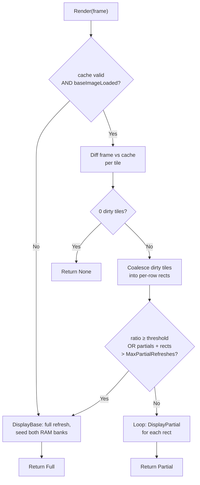

# end4in26

A standalone .NET 8 driver for the **Waveshare 4.26" e-Paper HAT** — 800 × 480, 1-bit B/W, SSD1677 controller. Single-file, single-class, drop-in.

The entire driver lives in [`src/Epd4in26/Epd4in26.cs`](src/Epd4in26/Epd4in26.cs). Two NuGet refs (`System.Device.Gpio`, `SixLabors.ImageSharp`) and you're done.

```csharp
using var epd = new Epd4in26();
epd.Init();
epd.Render(Epd4in26.LoadPackedFromFile("a.png"));   // first call: full refresh
epd.Render(Epd4in26.LoadPackedFromFile("b.png"));   // diffed: partial chunks or full
epd.Sleep();
```

`Render` caches the previous frame, diffs against the new one, and picks full-vs-partial automatically while honoring the 180 s full-refresh limiter — back-to-back full refreshes can **permanently damage the panel**. See [Refresh modes & cadence](#refresh-modes--cadence).

## Highlights

- **One file, one class.** Copy [`src/Epd4in26/Epd4in26.cs`](src/Epd4in26/Epd4in26.cs) into any .NET 8+ project; no project layout to keep in sync.
- **Smart `Render`.** Tile-based dirty detection, dirty-region coalescing, auto-promotion to a full refresh when too much changed.
- **Built-in panel protection.** Enforced minimum interval between full refreshes (default 180 s) and ghosting budget (default 5 partials between fulls).
- **Honest BUSY handling.** Polls the SSD1677's HIGH-busy polarity correctly (the opposite of UC8xxx panels) and surfaces stuck panels as a `TimeoutException` instead of silent bad pixels.
- **Hardware test suite** with eight scripted scenarios that assert on `RenderResult` so regressions surface fast.

## Table of contents

- [Quick start](#quick-start)
- [How it works](#how-it-works)
- [Hardware](#hardware)
- [Refresh modes & cadence](#refresh-modes--cadence)
- [API reference](#api-reference)
- [Tuning knobs](#tuning-knobs)
- [Build](#build)
- [Hardware test suite](#hardware-test-suite)
- [Deploy to a Pi](#deploy-to-a-pi)
- [Troubleshooting](#troubleshooting)
- [Project layout](#project-layout)
- [Contributing](#contributing)

## Quick start

Render a PNG, inspect the outcome, sleep the panel:

```csharp
using Waveshare.Standalone;

using var epd = new Epd4in26();
epd.Init();

var frame = Epd4in26.LoadPackedFromFile("hello.png");   // 800x480, any ImageSharp-supported format
var result = epd.Render(frame);

Console.WriteLine($"{result.Action} -- {result.DirtyTiles}/{result.TotalTiles} tiles, "
                + $"{result.PartialChunks} chunks, waited {result.WaitedForCooldown.TotalSeconds:F0}s");

epd.Sleep();
```

Typical output across a session:

```
Full    -- 120/120 tiles, 0 chunks, waited 0s     // first frame
None    -- 0/120 tiles, 0 chunks, waited 0s       // identical frame
Partial -- 3/120 tiles, 1 chunks, waited 0s       // small overlay change
Full    -- 78/120 tiles, 0 chunks, waited 142s    // big change AND inside cooldown
```

`Render` is the entry point you almost always want. Drop down to [`Display`, `DisplayBase`, `DisplayPartial`](#api-reference) only when you need explicit control of the refresh path.

## How it works

### Lifecycle

```mermaid
sequenceDiagram
    autonumber
    actor App
    participant Epd as Epd4in26
    participant GPIO as GpioController
    participant SPI as SpiDevice
    participant Panel as SSD1677

    %% --- Construction ---
    App->>Epd: new Epd4in26(pins, spiBus, 4 MHz)
    Epd->>GPIO: OpenPin RST, DC, CS, BUSY, PWR
    Epd->>GPIO: CS=High, PWR=High (gates panel VCC)
    Epd->>SPI: Create(bus, cs, Mode0)
    Note over Epd: SPI failure releases GPIO and rethrows

    %% --- Init ---
    App->>Epd: Init()
    Epd->>GPIO: Reset pulse on RST (High/Low/High)
    Epd->>Panel: WaitUntilReady (BUSY low)
    Epd->>SPI: 0x12 SWRESET
    Epd->>Panel: WaitUntilReady
    Note over Epd,Panel: Register setup
    Epd->>SPI: 0x18 0x80 (internal temp sensor)
    Epd->>SPI: 0x0C soft start
    Epd->>SPI: 0x01 driver output control
    Epd->>SPI: 0x3C 0x01 border waveform (full)
    Epd->>SPI: 0x11 0x01 data entry X+, Y-
    Epd->>SPI: 0x44/0x45 SetWindow (full screen)
    Epd->>SPI: 0x4E/0x4F SetCursor(0, 0)
    Epd->>Panel: WaitUntilReady
    Note over Epd: cache=null, baseImageLoaded=false<br/>cooldown clock PRESERVED — cannot bypass via re-init

    %% --- First Render: full path via DisplayBase ---
    App->>Epd: Render(frameA)
    Note over Epd: cache==null → DisplayBase
    Epd->>Epd: EnforceFullRefreshInterval()
    Note right of Epd: first refresh: no wait
    Epd->>SPI: 0x24 + frameA (RAM "new")
    Epd->>SPI: 0x26 + frameA (RAM "old" = baseline)
    Epd->>SPI: 0x22 0xF7 (full waveform)
    Epd->>SPI: 0x20 activate
    Epd->>Panel: WaitUntilReady (~4 s)
    Note over Epd: cache=frameA, baseImageLoaded=true<br/>lastFullRefresh=now, partials=0
    Epd-->>App: RenderResult(Full, all tiles, 0 chunks)

    %% --- Identical frame ---
    App->>Epd: Render(frameA again)
    Epd->>Epd: tile-diff vs cache
    Note right of Epd: 0 dirty tiles
    Epd-->>App: RenderResult(None, 0, 0)

    %% --- Small change ---
    App->>Epd: Render(frameB, local change)
    Epd->>Epd: tile-diff → N dirty tiles
    Epd->>Epd: CoalesceDirtyTiles → row-rects
    alt ratio < FullRefreshChangeThreshold AND partials+rects ≤ MaxPartialRefreshes
        loop for each rect
            Epd->>Epd: DisplayPartial(region, x, y, w, h)
            Epd->>GPIO: HW Reset (required per partial frame)
            Epd->>SPI: 0x18 0x80 (re-arm temp sensor)
            Epd->>SPI: 0x3C 0x80 (border floating)
            Epd->>SPI: 0x44/0x45 SetWindow(rect)
            Epd->>SPI: 0x4E/0x4F SetCursor(x, y)
            Epd->>SPI: 0x24 + region bytes
            Note right of Epd: 0x26 untouched<br/>holds previous-frame reference
            Epd->>SPI: 0x22 0xFF (partial waveform)
            Epd->>SPI: 0x20 activate
            Epd->>Panel: WaitUntilReady (~0.76 s)
            Epd->>Epd: UpdateCacheRegion, partials++
        end
        Epd-->>App: RenderResult(Partial, dirty, chunks)
    else ratio ≥ threshold OR ghosting budget would overflow
        Note over Epd: promote to full refresh
        Epd->>Epd: DisplayBase(frameB)
        Epd-->>App: RenderResult(Full, dirty, 0)
    end

    %% --- Limiter ---
    App->>Epd: Render(frameC) that needs full
    Epd->>Epd: EnforceFullRefreshInterval()
    Note right of Epd: less than MinFullRefreshInterval since last full
    alt RefreshLimitPolicy = Wait (default)
        Epd->>Epd: Thread.Sleep(remaining)
        Epd->>Epd: ...continues full refresh
    else RefreshLimitPolicy = Throw
        Epd-->>App: throw RefreshTooSoonException(remaining)
    end

    %% --- Sleep ---
    App->>Epd: Sleep()
    Epd->>SPI: 0x10 0x03 (deep sleep mode 2)
    Note over Epd,Panel: ~2 µA; panel ignores data until Init runs again

    %% --- Dispose ---
    App->>Epd: Dispose()
    Epd->>GPIO: CS, DC, RST, PWR = Low
    Epd->>GPIO: Dispose()
    Epd->>SPI: Dispose()
```

### `Render` decision flow



### Internal state

The driver tracks four fields that drive the decisions above:

| Field                             | Set by                         | Cleared by              | Meaning                                                        |
|-----------------------------------|--------------------------------|-------------------------|----------------------------------------------------------------|
| `_cache`                          | `DisplayBase`, partial regions | `Init`                  | Last frame as the panel sees it. Diff target for `Render`.    |
| `_baseImageLoaded`                | `DisplayBase`, `Clear`         | `Init`, `Display`       | True when RAM `0x26` holds a valid previous-frame reference.  |
| `_lastFullRefresh`                | Every full refresh             | _Never_ (intentionally) | Timestamp the 180 s limiter measures from.                    |
| `_partialRefreshesSinceLastFull`  | `DisplayPartial`               | Every full refresh      | Counted against `MaxPartialRefreshes` for ghosting budget.    |

Two non-obvious choices encoded above:

1. **`Init` preserves `_lastFullRefresh`.** Otherwise a caller could loop `Init → Display` to bypass the panel-protection limiter.
2. **`Display` (without `Base`) clears `_baseImageLoaded`** so the next `Render` is automatically routed through `DisplayBase` to reseed RAM `0x26` — partial refreshes won't work until then.

### Tile-based dirty detection

`Render` tiles the 800 × 480 frame into a `DiffTileWidth × DiffTileHeight` grid (default 80 × 40 → **10 × 12 = 120 tiles**), compares each tile against the cache byte-wise, then coalesces dirty tiles **horizontally within each row** into rectangles before issuing partial refreshes. Vertical merging across rows isn't done — adds branching for marginal benefit on typical workloads (clocks, status overlays).

```
columns: 10  (800 / 80)
rows:    12  (480 / 40)

  . . . . . . . . . .
  . . . X X . . . . .     <- two adjacent dirty tiles -> 1 chunk (160x40)
  . . . . . . . . . .
  . . . . . . X . . X     <- two isolated dirty tiles -> 2 chunks
  . . . . . . . . . .
```

Tweak the grid via [`DiffTileWidth`, `DiffTileHeight`, `FullRefreshChangeThreshold`](#tuning-knobs).

## Hardware

### Specifications

| Spec                     | Value                                  | Source                          |
|--------------------------|----------------------------------------|---------------------------------|
| Resolution               | 800 × 480, 1 bpp B/W                   | Datasheet §3                    |
| Active area              | 92.8 × 55.8 mm (219 PPI)               | Datasheet §3                    |
| Controller               | SSD1677                                | Datasheet §3                    |
| Logic supply (VCI)       | 2.2 – 3.6 V (typ 3.3 V)                | Datasheet §7.1                  |
| SPI clock                | up to **20 MHz** write / 2.5 MHz read  | Datasheet §7.4                  |
| Operating temperature    | 0 – 50 °C                              | Datasheet §6                    |
| Lifetime                 | ~1,000,000 refreshes / 5 years         | Datasheet §7.3                  |
| Operating current        | 8 mA (typ, white state)                | Datasheet §7.1                  |
| Sleep current            | 40 µA typ (RAM retained)               | Datasheet §7.1                  |
| Deep sleep current       | 2 µA typ                               | Datasheet §7.1                  |

Full PDFs in [`resources/datasheets/`](resources/datasheets/).

### Pinout

Raspberry Pi 40-pin header, BCM numbering — matches the driver defaults:

| HAT pin  | Pi pin (BCM) | Function                                     |
|----------|--------------|----------------------------------------------|
| VCC      | 3.3 V        | Logic supply                                 |
| GND      | GND          | Ground                                       |
| DIN      | GPIO 10 (MOSI) | SPI data in                                |
| CLK      | GPIO 11 (SCLK) | SPI clock                                  |
| CS       | GPIO 8       | Chip select (active low)                     |
| DC       | GPIO 25      | Data / command select                        |
| RST      | GPIO 17      | Hardware reset                               |
| BUSY     | GPIO 24      | Busy signal (HIGH = busy, see below)         |
| PWR      | GPIO 18      | Newer HATs gate panel VCC here — must be HIGH |

Override any of these in the `Epd4in26` constructor.

### BUSY pin polarity

SSD1677 drives BUSY **HIGH = busy, LOW = ready** — opposite polarity to older Waveshare panels (UC8xxx). Don't "fix" the polarity check in `WaitUntilReady`; it is correct for this controller.

## Refresh modes & cadence

Black-and-white e-paper panels can be **physically destroyed by software** if you violate refresh-cadence rules. Internalize these before touching display code.

### Hard rules (failure modes are permanent)

1. **At least one full refresh every 24 hours.** Otherwise ghosting / image sticking sets in. Datasheet §13(5).
2. **Minimum 180 s between full refreshes** in steady-state operation. (Wiki "Precautions for e-Paper screen refresh".) Partial refreshes are exempt from the 180 s floor.
3. **Never run partial-only forever.** After ~5 partials to the same area, do a full refresh to discharge residual ghosting. The wiki is firm: "the residual image problem will become more and more serious, or even damage the screen."
4. **Always sleep or power off after a refresh.** Leaving the panel powered up at high voltage between updates burns out the panel — explicitly listed by the vendor as unrepairable damage. Deep sleep pulls ~2 µA.
5. **Re-init after deep sleep.** Once `0x10 0x03` is sent, the panel ignores image data until a new init sequence runs. The first wake also tends to refresh dirty — full-refresh once before partial updates.
6. **Switching partial → full requires a full init**, not just a different turn-on byte. Wiki Q: "Why can't the image be displayed when full refresh after partial refresh?"
7. **Ship/store with a fully white image** to avoid bake-in.

### What the driver enforces vs. what you own

| Rule                                       | Enforced by driver                         | Caller's responsibility |
|--------------------------------------------|--------------------------------------------|-------------------------|
| 180 s minimum between full refreshes       | ✅ `MinFullRefreshInterval` + `RefreshLimitPolicy` | — |
| Max ~5 partials before a full refresh      | ✅ `MaxPartialRefreshes`, auto-promote in `Render` | — |
| 24 h max without a full refresh            | ❌                                          | Schedule one in your app |
| Always sleep/power off after a refresh     | ❌                                          | Call `Sleep()`           |
| Re-init after deep sleep                   | ❌                                          | Call `Init()` after wake |
| Ship/store with a white image              | ❌                                          | Call `Clear()` before shutdown |

### Refresh-mode timings (at 23 °C, datasheet §7.1)

| Mode        | `0x22` arg | Typical time | When to use                                          |
|-------------|------------|--------------|------------------------------------------------------|
| **Full**    | `0xF7`     | ~4 s         | Default; clears ghosting; flickers visibly           |
| **Fast**    | `0xC7`     | ~1 s         | Init via fast variant (writes `0x1A=0x5A`, `0x22=0x91`); less ghost-clearing |
| **Partial** | `0xFF`     | ~0.76 s      | Window updates after a base image is loaded; no flicker |
| **4-Gray**  | `0xC7`     | ~ several s  | Requires a custom 112-byte LUT loaded across `0x32`/`0x03`/`0x04`/`0x2C` |

This driver implements **Full** and **Partial**. Fast and 4-Gray are documented for reference but not exposed.

### Partial-refresh protocol (canonical sequence)

What the SSD1677 actually needs, distilled from the Waveshare reference (`EPD_4in26_Display_Part`):

1. **Seed the panel:** write the base image to **both** RAMs (`0x24` "new" and `0x26` "old") and run a normal full refresh. RAM `0x26` is the previous-frame reference the partial waveform diffs against.
2. **For each partial frame:**
   - Hardware reset (yes — every partial frame; the C driver does this).
   - `0x18 0x80` — re-select internal temperature sensor.
   - `0x3C 0x80` — switch border to floating (vs `0x01` for full).
   - `SetWindow(x, y, x+w-1, y+h-1)` and `SetCursor(x, y)` to bound the dirty rect.
   - `0x24` + new pixel data for that window only (do **not** rewrite `0x26`).
   - Turn on with `0x22 0xFF`, `0x20`, wait BUSY.
3. **After several partials** (or any major scene change), run a full refresh to clear ghosting.

`x` and `width` must be multiples of 8 — the SSD1677 ignores the low 3 bits of the X cursor. The driver uses data-entry mode `0x11 0x01` (X+, Y−).

### SSD1677 command cheat-sheet

| Cmd  | Purpose                                                          |
|------|------------------------------------------------------------------|
| 0x01 | Driver Output Control (gate scan range, MUX)                     |
| 0x0C | Soft start                                                       |
| 0x10 | Deep sleep mode (`0x03` = mode 2)                                |
| 0x11 | Data Entry Mode                                                  |
| 0x12 | SWRESET                                                          |
| 0x18 | Temperature Sensor Control (`0x80` = internal)                   |
| 0x1A | Temperature Sensor Write (used by Fast init: `0x5A`)             |
| 0x20 | Activate Display Update Sequence                                 |
| 0x22 | Display Update Control 2 — `0xF7` full · `0xC7` fast · `0xFF` partial · `0x91` fast-init internal |
| 0x24 | Write RAM (B/W "new")                                            |
| 0x26 | Write RAM (Red/"old", used by partial as previous frame)         |
| 0x32 | Write LUT register (4-Gray custom waveform)                      |
| 0x3C | Border waveform (`0x01` full, `0x80` partial)                    |
| 0x44 | RAM X start/end                                                  |
| 0x45 | RAM Y start/end                                                  |
| 0x4E | RAM X cursor                                                     |
| 0x4F | RAM Y cursor                                                     |

Full reference: [`resources/datasheets/SSD1677.pdf`](resources/datasheets/SSD1677.pdf).

## API reference

### Public surface

| Member                                                     | What it does                                                                                  |
|------------------------------------------------------------|-----------------------------------------------------------------------------------------------|
| `new Epd4in26(...)`                                        | Open GPIO + SPI. Override pins and SPI parameters via constructor args; defaults match the table in [Pinout](#pinout). |
| `Init()`                                                   | Reset, SWRESET, register setup. Required after construction and after `Sleep`. Preserves cooldown timer. |
| `Render(byte[] frame) → RenderResult`                      | Recommended entry point. Diffs against cache, picks full/partial/no-op, honors limiter.       |
| `Display(byte[] frame)`                                    | Force a full refresh. Does **not** seed RAM `0x26`; next `Render` will reseed via `DisplayBase`. |
| `DisplayBase(byte[] frame)`                                | Force a full refresh and seed RAM `0x26`. Use this when you want subsequent partials to work. |
| `DisplayPartial(byte[] regionFrame, int x, int y, int w, int h)` | One partial-refresh chunk. Requires a prior `DisplayBase`/`Clear`. `x`/`w` multiples of 8. |
| `Clear()`                                                  | Full refresh to white. Counts as a full refresh against the limiter.                          |
| `Sleep()`                                                  | Deep sleep mode 2 (~2 µA). Call `Init()` to wake.                                             |
| `Dispose()`                                                | Drive all output pins low, release GPIO and SPI.                                              |
| `static LoadPackedFromFile(string path, byte threshold = 128)` | Load any ImageSharp-supported file, threshold to 1 bpp, return a packed frame.            |
| `static PackedRegionFromFullFrame(byte[] full, int x, int y, int w, int h)` | Crop a sub-region from a packed frame, ready for `DisplayPartial`.           |

### `RenderResult`

```csharp
public readonly record struct RenderResult(
    RenderAction Action,        // None | Partial | Full
    int DirtyTiles,
    int TotalTiles,
    int PartialChunks,
    TimeSpan WaitedForCooldown  // > 0 only when the limiter blocked before a Full
);
public double ChangedRatio => TotalTiles > 0 ? (double)DirtyTiles / TotalTiles : 0;
```

`Action` is the contract you read in tests:

- **`None`** — frame matched the cache; nothing sent to the panel.
- **`Partial`** — one or more chunks sent for the coalesced dirty rects.
- **`Full`** — first frame, large change, ghosting-budget overflow, or stale partial base.

### Frame format

- **Layout:** 1 bpp packed, MSB-first per byte. **Bit 1 = white**, bit 0 = black.
- **Size:** `Width × Height / 8 = 48,000 bytes` for a full frame (`Epd4in26.FrameSize`).
- **Region frames** for `DisplayPartial` are `(width / 8) × height` bytes, row-major.

## Tuning knobs

All knobs are public read/write properties on `Epd4in26`. Defaults are conservative; lower at your own risk.

| Property                       | Default       | What it controls                                                                                 |
|--------------------------------|---------------|--------------------------------------------------------------------------------------------------|
| `MinFullRefreshInterval`       | `180 s`       | Floor between full refreshes. Lowering this risks **permanent panel damage**.                    |
| `MaxPartialRefreshes`          | `5`           | Partials allowed between full refreshes before `Render` auto-promotes to Full.                   |
| `RefreshLimitPolicy`           | `Wait`        | `Wait` blocks until cooldown elapses; `Throw` raises `RefreshTooSoonException`.                  |
| `DiffTileWidth` × `DiffTileHeight` | `80 × 40`  | `Render` diff grid. Must divide `Width`/`Height`; `DiffTileWidth` must be a multiple of 8.       |
| `FullRefreshChangeThreshold`   | `0.5`         | Fraction of dirty tiles at which `Render` promotes from partial chunks to a full refresh.        |

**Read-only observers:**

| Property                            | Meaning                                                                        |
|-------------------------------------|--------------------------------------------------------------------------------|
| `LastFullRefresh`                   | UTC timestamp of the most recent full refresh, or `null` if none yet.          |
| `PartialRefreshesSinceLastFull`     | Current ghosting-budget consumption.                                           |
| `IsFullRefreshOverdue`              | `true` when `PartialRefreshesSinceLastFull ≥ MaxPartialRefreshes`.             |
| `TimeUntilNextFullRefreshAllowed`   | `TimeSpan` the limiter will block (or throw on) the next full refresh.         |

### Tuning examples

**Faster status-line updates** (smaller tiles → tighter dirty regions):

```csharp
epd.DiffTileWidth  = 40;   // 800 / 40 = 20 columns
epd.DiffTileHeight = 20;   // 480 / 20 = 24 rows -> 480 tiles
```

**Throw rather than block on cooldown** (CI / tests that should never sleep):

```csharp
epd.RefreshLimitPolicy = RefreshPolicy.Throw;
try { epd.Render(frame); }
catch (RefreshTooSoonException ex) { /* ex.Remaining */ }
```

**Force-promote sooner** (highly dynamic scenes — less ghosting, more full flashes):

```csharp
epd.FullRefreshChangeThreshold = 0.25;
```

## Build

```sh
dotnet build                          # builds the lib (or open end4in26.sln in your IDE)
dotnet build tests/Epd4in26.Hardware  # builds the test runner (binary: EpdTest)
```

Targets `net8.0`. Builds anywhere, but `GpioController` only works at runtime on Linux with `/dev/spidev*` (i.e., a Raspberry Pi or compatible SBC). [`Directory.Build.props`](Directory.Build.props) sets `TreatWarningsAsErrors=true` for both projects.

The library project ([`src/Epd4in26/Epd4in26.csproj`](src/Epd4in26/Epd4in26.csproj)) is NuGet-pack-ready:

```sh
dotnet pack src/Epd4in26 -c Release    # -> src/Epd4in26/bin/Release/Waveshare.Epd4in26.0.1.0.nupkg
```

## Hardware test suite

[`tests/Epd4in26.Hardware/`](tests/Epd4in26.Hardware/) is a console runner that drives the panel through scripted scenarios. Each test couples a `RenderResult` assertion (catches protocol regressions) with a printed visual checklist and a `y/n/skip` prompt (catches everything the bus can't see — residue, ghosting, dead pixels). The full follow-along, one section per test, is in [`tests/Epd4in26.Hardware/VISUAL.md`](tests/Epd4in26.Hardware/VISUAL.md) — read it with the panel in front of you.

```sh
EpdTest list                  # show tests + summaries
EpdTest all                   # run all tests, prompt after each
EpdTest partial-single        # run one test with the prompt
EpdTest --no-prompt all       # CI / smoke: assertions only, no visual judgement
EpdTest generate              # (re)render the PNGs into resources/patterns/
EpdTest image ./pic.png       # ad-hoc: render an 800x480 image file
```

### Tests

| Name             | Asserts                                                            | Visual focus                                |
|------------------|--------------------------------------------------------------------|---------------------------------------------|
| `clear`          | (visual only)                                                      | Uniformly white, no residue or dead pixels  |
| `baseline`       | First `Render` after `Init` is `Full` or `None`                    | All 120 tile labels A1–J12 sharp & complete |
| `noop`           | Re-rendering the same frame is `None`, 0 dirty tiles               | Second render does not flicker              |
| `partial-single` | One tile change → `Partial`, exactly 1 chunk                       | Replaced tile has no residue of prior label |
| `partial-bbox`   | Two corner-tile changes → `Partial`, 1 chunk (bounding box)        | Middle tiles untouched by the huge bbox     |
| `partial-two-locations` | Two partials at different locations → both `Partial`        | First update still on panel after the second |
| `ghost-budget`   | 5 successive partials to the same tile → all `Partial`             | No accumulated digit ghosting after step 5  |
| `auto-promote`   | 6th partial after a full budget → auto-promotes to `Full`          | Visible full-refresh flicker; clean result  |
| `promote-large`  | ≥ 50 % of tiles dirty in one render → `Full`                       | Clean alternating-row pattern, no residue   |
| `sleep-wake`     | `Sleep` → `Init` → `Render` returns `Full`                         | Clean wake; no garbage between frames       |

Test PNGs are pre-rendered by [`PatternGenerator.cs`](tests/Epd4in26.Hardware/PatternGenerator.cs) (ImageSharp + SixLabors.Fonts) and committed under [`tests/Epd4in26.Hardware/resources/patterns/`](tests/Epd4in26.Hardware/resources/patterns/) so the runner has no font / drawing dependencies at test time. Regenerate after editing the generator: `EpdTest generate`. The bundled font ([`Inter-Bold.ttf`](tests/Epd4in26.Hardware/resources/fonts/Inter-Bold.ttf), SIL OFL 1.1) is committed alongside.

### Environment variables

| Variable             | Default | Notes                                                                |
|----------------------|---------|----------------------------------------------------------------------|
| `EPD_TEST_INTERVAL`  | `180`   | `MinFullRefreshInterval` in seconds. Runner warns if below 180. Below 180 s, `auto-promote` and `promote-large` are the only tests that need it lowered to complete in reasonable time. |
| `NO_COLOR`           | unset   | Set to any value to suppress ANSI colors.                            |

## Deploy to a Pi

[`deploy.sh`](deploy.sh) does the publish + rsync + optional remote run. Defaults target a Pi Zero 2 W with default config (`linux-arm64`, hostname `raspberrypi.local`, user `pi`). It runs an SSH preflight before publishing so a missing host fails fast.

```sh
./deploy.sh                          # build + sync, no run
./deploy.sh run                      # build + sync + run "all"
./deploy.sh run partial-single       # build + sync + run a single test
./deploy.sh run image ./pic.png      # build + sync + ad-hoc render
```

Override defaults via env vars:

```sh
PI_HOST=epd.local PI_USER=christian RID=linux-arm ./deploy.sh run
```

The publish is **self-contained** (~80 MB), so no .NET runtime install is needed on the Pi. The Pi just needs SPI enabled (`sudo raspi-config` → Interface Options → SPI) and the HAT wired correctly (see [Pinout](#pinout)).

### VS Code tasks

[`.vscode/tasks.json`](.vscode/tasks.json) exposes:

- **build** — `dotnet build tests/Epd4in26.Hardware` (default build task)
- **deploy** — `./deploy.sh`
- **deploy + run all tests** — `./deploy.sh run`
- **deploy + run test** — prompts for a test name (default test task)
- **deploy + render image** — prompts for an image path

## Troubleshooting

| Symptom                                              | Likely cause                                                                                 | Fix                                                                                       |
|------------------------------------------------------|----------------------------------------------------------------------------------------------|-------------------------------------------------------------------------------------------|
| `TimeoutException: BUSY pin still high after 50000 ms` | Panel disconnected, PWR pin low, or controller hung.                                       | Check wiring (especially PWR=GPIO 18 HIGH on newer HATs). Power-cycle the panel.          |
| Garbled / scrambled pixels                           | SPI mode/clock wrong; cable too long; wrong RID published.                                   | Confirm `Mode0`, lower `spiClockHz` to 2 MHz, check `RID=linux-arm` vs `linux-arm64`.     |
| `InvalidOperationException: Partial refresh requires a base image` | Called `DisplayPartial` after `Display` (which doesn't seed RAM `0x26`).         | Call `DisplayBase` or `Clear` first, or use `Render` which handles the routing.           |
| `RefreshTooSoonException` thrown from `Display`/`DisplayBase`/`Clear` | `RefreshLimitPolicy = Throw` and less than 180 s since the last full refresh. | Wait `ex.Remaining`, or switch to `RefreshPolicy.Wait`, or call `Render` (auto-handles).  |
| Visible ghosting that doesn't go away                | More than ~5 consecutive partials without a full refresh.                                    | Lower `MaxPartialRefreshes` or call `Clear`/`DisplayBase` explicitly.                     |
| `dotnet publish` succeeds but the binary crashes on Pi | Published with the wrong RID for the OS bitness.                                           | 32-bit Raspberry Pi OS → `RID=linux-arm`; 64-bit → `RID=linux-arm64`.                     |
| Image looks inverted (black/white swapped)           | Threshold or bit-packing inverted in your pipeline.                                          | Remember: **bit 1 = white**. `LoadPackedFromFile` handles this correctly by default.       |

## Project layout

```
.
├── src/
│   └── Epd4in26/                    # net10.0 class library (NuGet-pack ready)
│       ├── Epd4in26.csproj
│       └── Epd4in26.cs              # the driver (single file, drop-in)
├── tests/
│   └── Epd4in26.Hardware/           # hardware integration test suite (binary: EpdTest)
│       ├── Epd4in26.Hardware.csproj
│       ├── Program.cs               # CLI: list / all / <name> / generate / image
│       ├── Tests.cs                 # test catalogue + assertions + visual checklists
│       ├── PatternGenerator.cs      # ImageSharp + SixLabors.Fonts PNG generator
│       ├── VISUAL.md                # human follow-along; one section per test
│       └── resources/
│           ├── fonts/               # Inter-Bold.ttf + Inter-Regular.ttf (SIL OFL 1.1)
│           └── patterns/            # committed 1bpp test PNGs (regen via EpdTest generate)
├── Directory.Build.props            # shared csproj props (TFM, langversion, warnings)
├── end4in26.slnx
├── deploy.sh                        # publish + rsync to Pi, optionally run a test
├── .vscode/
│   └── tasks.json                   # build / deploy / deploy+run shortcuts
├── resources/
│   ├── datasheets/                  # panel + SSD1677 PDFs
│   └── e-Paper-reference/           # Waveshare upstream repo (gitignored)
├── .editorconfig
├── LICENSE                          # MIT
└── README.md
```

[`resources/e-Paper-reference/`](resources/) is a shallow clone of [waveshareteam/e-Paper](https://github.com/waveshareteam/e-Paper) for cross-referencing the canonical C/Python driver. It's gitignored; re-clone if missing:

```sh
git clone --depth=1 https://github.com/waveshareteam/e-Paper.git resources/e-Paper-reference
```

## Contributing

### Commit messages

The repository follows the [Conventional Commits](https://www.conventionalcommits.org/) specification. Each message is structured as:

```
<type>[optional scope]: <description>

[optional body]

[optional footer(s)]
```

`<type>` is one of `feat`, `fix`, `docs`, `style`, `refactor`, `test`, `chore`. Optional `[scope]` narrows the change (e.g., `api`, `driver`, `tests`). Examples:

```
feat(driver): add 4-gray render path
fix(tests): correct expected chunk count for partial-multi
docs: update SSD1677 cheat-sheet
refactor: extract ValidatePartialRegion helper
```

**Please don't co-author commits with AI assistants** — it muddles attribution and isn't an accurate reflection of who contributed.

### License

MIT — see [LICENSE](LICENSE). Mirrors the Waveshare reference at [github.com/waveshareteam/e-Paper](https://github.com/waveshareteam/e-Paper) (`RaspberryPi_JetsonNano/c/lib/e-Paper`).
