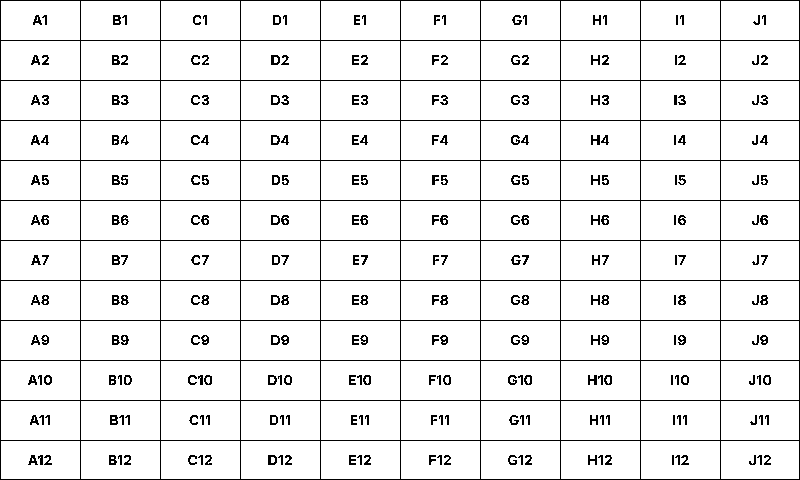
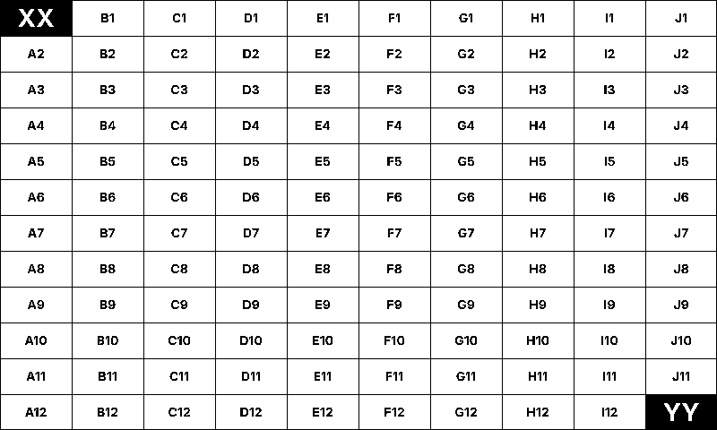
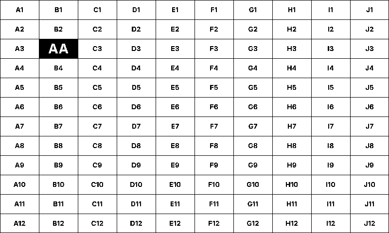
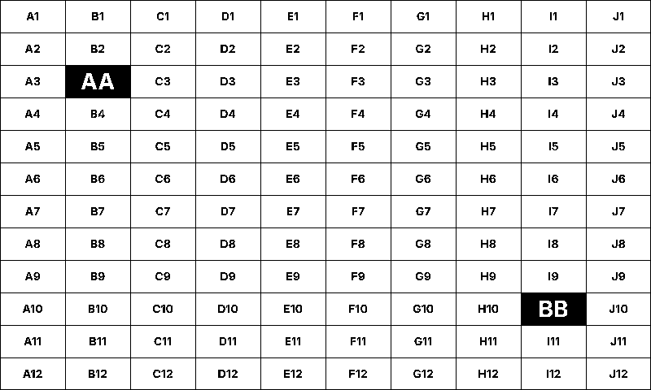
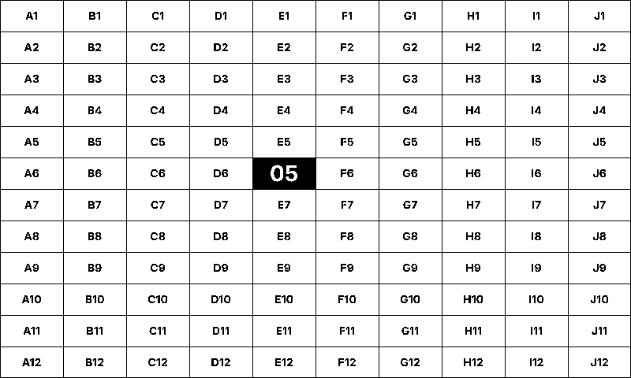
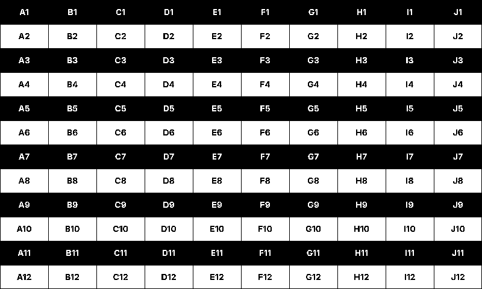

# Visual test follow-along

Hardware tests for the Waveshare 4.26" e-Paper HAT. Half of every test is the panel's actual
behaviour — ghosting, residue, dead pixels, partial-update accuracy — which only a human can
judge. This document is the checklist you read with the panel in front of you. Each section
matches a test name in `Tests.cs` so you can step through one at a time.

## Running

```sh
EpdTest list                  # show tests
EpdTest all                   # run every test; prompt y/n after each one
EpdTest <test-name>           # run one test with the y/n prompt
EpdTest --no-prompt all       # CI mode: assertion failures only, no visual judgement
EpdTest generate              # rebuild the PNGs under resources/patterns/
```

When prompted, answer `y` (passes the visual check), `n` (fails it; you can leave a note), or
`skip` if you weren't watching. Visual `n` counts as a failure in the final summary alongside
any assertion failures.

> **Cooldown:** the driver enforces a 180 s minimum between full refreshes by default. To run
> the suite in under an hour, lower the floor: `EPD_TEST_INTERVAL=5 EpdTest all`. Anything
> below 180 s on a panel you care about long-term risks permanent damage — use only for
> iteration, never in production.

## Test patterns

The test PNGs live in [`resources/patterns/`](resources/patterns/). They're generated by
[`PatternGenerator.cs`](PatternGenerator.cs) and committed to the repo so the runner doesn't
need fonts or drawing libraries at test time. Regenerate with `EpdTest generate`.

The base layout is a **10 × 12 grid of labelled tiles**, 80 × 40 px each — exactly the
driver's dirty-detection tile grid. Columns are letters A–J, rows are numbers 1–12, so every
tile has a unique label like `B3` or `J12`. Tests that change one or two tiles overwrite the
label with a big inverted number (`02`, `XX`, etc.) on a black background. If a partial
refresh has residue, you see the old label faintly behind the new number.

## Test catalogue

### 1. `clear`

**Action:** `epd.Clear()`. Full refresh to all-white. Counts against the 180 s limiter.

**Look for:**
- Panel is uniformly white from edge to edge.
- No faint outlines of any previous content.
- No stuck-on (black) or stuck-off (white) pixels.

### 2. `baseline`

**Action:** Render the labelled 10 × 12 grid. First render after `Init` is always Full.

**Expected on the panel:**



**Look for:**
- Every one of the 120 tiles shows a readable label (A1–J12). Spot-check a handful.
- All glyphs sharp and complete — no missing pixels inside any letter.
- Grid lines are continuous, straight, and pixel-thin.

### 3. `noop`

**Action:** Render the baseline grid, then render the same frame again.

**Expected on the panel:** identical to the [baseline](#2-baseline) image; the second render
must produce no visible change at all.

**Asserts:** second render returns `RenderAction.None` with 0 dirty tiles.

**Look for:**
- The panel did **not** flicker on the second render. No full-refresh flash, no partial-region flash.
- Grid still readable, identical to before.

### 4. `partial-single`

**Action:** Baseline grid, then a frame where tile **E6** is replaced with an inverted "02".

**Expected on the panel:**


**Asserts:** `RenderAction.Partial`, exactly 1 chunk.

**Look for:**
- Only tile E6 changed; every other tile is untouched.
- Inside the black E6 tile, the white "02" is crisp. There is **no faint outline of the
  original "E6" label** still visible underneath. *This is the primary residue check.*
- No grey halo or speckle around the digits.
- The four edges of the inverted tile line up with the original grid lines.

### 5. `partial-bbox`

**Action:** Baseline grid, then a frame where **A1** (top-left) and **J12** (bottom-right) are
both inverted (`XX` and `YY`).

**Expected on the panel:**



**Asserts:** `RenderAction.Partial`, 1 chunk (the driver coalesces dirty tiles into a single
bounding box that spans nearly the whole panel).

**Look for:**
- A1 and J12 are now inverted; every tile between them is **unchanged** with its original
  label. The partial waveform compares the current frame to the previous frame in RAM 0x26
  and only transitions pixels that actually differ — even though the bounding-box rectangle
  covers the whole grid, only the two corners should change visually.
- No partial-update banding or gradient sweeping across the middle of the panel.

### 6. `partial-two-locations`

**Action:** Baseline grid, then two partial refreshes at different locations: first **B3**
becomes inverted `AA`, then **I10** becomes inverted `BB`. The second render's diff is just
the new I10 change — but the panel must still show both updates.

**Expected on the panel** — after the first partial, then after the second:

| After 1st partial (B3) | After 2nd partial (I10) |
| :--- | :--- |
|  |  |

**Asserts:** both renders return `RenderAction.Partial`, each with 1 chunk.

**Look for:**
- After the first partial: only B3 changed.
- After the second partial: B3 is **still** inverted with `AA` **and** I10 is now inverted
  with `BB`. Both updates are visible at the same time.
- **CRITICAL — what this test catches:** if B3 reverts to its plain baseline label after the
  second partial, the post-drive mirror to RAM `0x26` is broken. The partial-refresh
  waveform compares `0x24` and `0x26` across the whole panel; if the previous partial's data
  isn't mirrored into `0x26` after its drive, the next partial finds the two RAMs disagreeing
  at the previously-changed region and transitions it back toward the baseline. The first
  partial "disappears" and the panel falls back toward the last full render.
- No flicker between the two partials; both should be smooth partial-refresh transitions.

### 7. `ghost-budget`

**Action:** Baseline grid, then five consecutive partial refreshes writing `01`, `02`, `03`,
`04`, `05` into tile E6.

**Expected on the panel** — after step 1, then after step 5:

| After step 1 | After step 5 |
| :--- | :--- |
|  |  |

**Asserts:** each step returns `RenderAction.Partial`.

**Look for after each step:**
- E6 shows the current digit pair inverted (white on black). No flicker.

**Look for after step 5 (critical):**
- E6 shows `05` only. The earlier digits `01`–`04` are **not** faintly visible behind the
  current one. If you can read any prior digit through the current one, the partial-refresh
  waveform isn't fully clearing differences — that's the residue this test exists to catch.
- The inverted black background is uniformly black across all five updates.

### 8. `auto-promote`

**Action:** Self-contained — does five partials into E6 (`01`–`05`) to spend the ghost
budget, then renders a sixth partial frame (`06`). With the partial counter at 5 and
`MaxPartialRefreshes = 5`, the driver auto-promotes to a full refresh on render six.

**Expected on the panel** after the sixth render:


**Asserts:** `RenderAction.Full`.

**Look for:**
- A visible full-refresh flicker (panel briefly inverts, then settles). Different texture
  from a partial update.
- E6 shows `06` inverted. Rest of the grid is clean — no ghosting from any of the five
  partials that preceded the full refresh.

If the assertion fails with `expected Full`, check the printed cooldown remaining. The driver
only promotes to Full when the 180 s limiter allows it; if the test runs back-to-back with no
cooldown gap, lower `EPD_TEST_INTERVAL`.

### 9. `promote-large`

**Action:** Baseline grid, then a frame where every second row of tiles is inverted
(alternating black/white bands, one tile tall). About 50 % of tiles change in one render.

**Expected on the panel:**



**Asserts:** `RenderAction.Full` — the change ratio crosses
`FullRefreshChangeThreshold` (0.5) so `Render` skips partials and promotes immediately.

**Look for:**
- Visible full-refresh flicker.
- Final image: black rows and white rows, alternating, each one tile tall. Labels inverted
  on the black rows, normal on the white rows.
- No residue of the previous baseline visible on the new pattern.

### 10. `sleep-wake`

**Action:** `epd.Sleep()` → wait 1 s → `epd.Init()` → render the baseline grid.

**Expected on the panel:** the [baseline](#2-baseline) grid, rendered fresh after the wake.

**Asserts:** the post-wake render returns `RenderAction.Full` (cache was cleared by `Init`).

**Look for:**
- Visible full-refresh flicker. Panel comes back cleanly with the baseline grid.
- No garbage, static, or partial-frame artefacts during the wake transition.
- All 120 labels readable as in test 2.

## When to regenerate the PNGs

Run `EpdTest generate` after you change anything in
[`PatternGenerator.cs`](PatternGenerator.cs) — the test runner loads the **committed** PNGs
out of `resources/patterns/`, so unwritten changes to the generator don't affect a test run.
The command writes back into the source tree when one is reachable from the running binary
(typical for local `dotnet run`); when running the published binary on the Pi, it falls back
to the binary's own output directory and prints a warning.

After regenerating, eyeball one or two of the PNGs in an image viewer before committing —
the patterns must remain pure 1bpp (no anti-aliased edges) for the threshold-pack at load
time to be faithful.

## Fonts

[`resources/fonts/Inter-Bold.ttf`](resources/fonts/Inter-Bold.ttf) and `Inter-Regular.ttf` are
[Inter](https://rsms.me/inter/), licensed under the SIL Open Font License 1.1 — see
[`LICENSE-Inter.txt`](resources/fonts/LICENSE-Inter.txt). They're bundled rather than
system-resolved so the generator output is identical on any machine.
